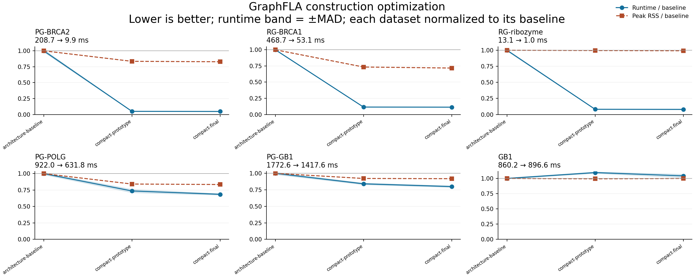

# Compact construction experiment

The baseline is the **previous optimized implementation**, `992e49d`, not main.
The experiment is isolated on `codex/construction-compact-experiment`.
The final implementation is `53c8f62`; the earlier prototype is `a8253be`.

## Scope

ASCII sequence input is validated and encoded directly into a compact array of
variable sites. Constant positions are stored once during construction. A column
source decodes attributes after topology filtering has selected the surviving
nodes. General tables retain their existing preparation and encoding rules.
Neighbor kernels receive fitness arrays instead of a DataFrame.

Every build still returns a normal igraph with **all original feature attributes**
already attached, including invariant positions. `graph.vs`, `get_data()` and
GraphML retain their existing behavior. Timings include attribute materialization;
work has not been shifted to the first read. This compatibility also limits the
reduction in final graph storage: constant positions remain expanded in igraph.

The experiment does not replace igraph, introduce a sparse mutation backend,
change analysis implementations, or claim that the entire build is transactional.
Unicode, table inputs, custom input handlers and invalid-input diagnostics use
the general preparation path.

## Measurement

All 21 datasets use the existing isolated-process protocol: three timing workers,
one warmup and three measured builds per worker; three separate memory workers.
Input loading is outside timing. Peak RSS includes Python, imports and loaded
inputs. The machine and dependencies match the prior experiment.

The order is baseline, prototype, repeated baseline control, final candidate.
The repeated control's runtime differences from the initial baseline all remain
inside the effect/noise gate. The prototype initially showed a GB1 regression;
both that result and the subsequent measurements are retained.

Results compare process medians against the repeated baseline control. `Clear`
requires an effect above both 5% and three times the combined measured dispersion;
`Unresolved` does not establish a speed change.

| Dataset | Control (ms) | Candidate (ms) | Speed ratio | Peak RSS ratio | Runtime evidence |
|---|---:|---:|---:|---:|---|
| WReOs | 1.62 | 1.57 | 1.03× | 0.99× | Unresolved |
| CR6261 | 4.74 | 5.08 | 0.93× | 0.99× | Unresolved |
| TrpB3I | 31.49 | 29.15 | 1.08× | 1.04× | Unresolved |
| Westmann | 20.48 | 19.72 | 1.04× | 0.99× | Unresolved |
| CR9114 | 120.66 | 116.87 | 1.03× | 1.16× | Unresolved |
| GB1 | 893.89 | 906.95 | 0.99× | 1.00× | Unresolved |
| Papkou | 576.22 | 572.68 | 1.01× | 1.00× | Unresolved |
| Papkou-filtered | 297.48 | 277.05 | 1.07× | 0.95× | Clear |
| PG-GB1 | 1772.07 | 1418.87 | 1.25× | 0.92× | Clear |
| PG-BRCA2 | 215.39 | 9.95 | 21.65× | 0.83× | Clear |
| PG-POLG | 924.73 | 631.83 | 1.46× | 0.83× | Clear |
| RG-BRCA1 | 483.29 | 53.12 | 9.10× | 0.69× | Clear |
| RG-tRNA | 13.37 | 7.65 | 1.75× | 0.97× | Clear |
| RG-ribozyme | 13.39 | 1.05 | 12.77× | 0.99× | Clear |
| RG-LINE1 | 473.21 | 403.40 | 1.17× | 0.94× | Clear |
| synthetic-boolean | 7.21 | 6.91 | 1.04× | 0.99× | Unresolved |
| synthetic-ordinal | 1.14 | 1.06 | 1.08× | 1.00× | Unresolved |
| synthetic-dna | 6.95 | 5.92 | 1.17× | 1.00× | Clear |
| synthetic-rna | 1.49 | 0.71 | 2.11× | 0.99× | Clear |
| synthetic-sequence | 1.54 | 0.66 | 2.33× | 1.01× | Clear |
| synthetic-hpo | 1.45 | 1.39 | 1.04× | 0.98× | Unresolved |

Building each of the 21 datasets once gives a sum of process medians of **5.86 → 4.47 seconds** (23.7% less time). This equal-per-dataset workload is descriptive, not an estimate for an arbitrary user workload.

The largest gains are in long-background inputs. Boolean, HPO and most short-sequence workloads remain effectively unchanged. The final run has no runtime regressions beyond the comparison gate; the prototype GB1 slowdown did not reproduce. Final code only makes preprocessing metadata local and tidies descriptions; it introduces no additional algorithmic optimization over the prototype.



[All 21 curves](results/architecture-all.png) · [Vector version](results/architecture-all.svg). Curves start at the initial baseline; the table uses the repeated control.

## Decision

Keep this bounded change: the gains recur across several complete protein and RNA assays, including substantial improvements beyond a single 20% case. The production diff adds 166 lines and removes 69, with two small attribute sources and no new public options. These results do not justify replacing the graph backend or starting a broader rewrite.

The full final run records a 1.16× peak-RSS ratio for CR9114. A targeted check with five interleaved fresh-process pairs found overlapping ranges: baseline 324–394 MiB, candidate 339–391 MiB; the median ratio was 0.97×. These measurements do not establish a persistent memory regression or a memory improvement for that dataset. [Raw repeated memory samples](results/architecture-memory-repeat.json) are retained alongside the original full-run result.

## Correctness

- **1,635 tests pass without skips** on Python 3.9, 3.11 and 3.13.
- Papkou still matches the author graph exactly: **135,178 nodes and 324,044
  directed edges**, including genotype identities and unrounded fitness values.
- Every one of the **21 complete benchmark inputs** has identical ordered edges,
  vertex and edge attribute hashes (including names, order and inferred dtypes),
  encoded configurations, variable-site metadata, plateaus, neutral adjacency and
  local/global optimum indices between baseline and candidate.
- The new regression cases compare compact and general paths across protein,
  DNA and RNA, input containers, duplicate/lowercase sequences, minimization,
  threshold modes and neutral pairs. A custom input handler remains authoritative.
- ASV discovery passes, as do **123 parameterized cases across 14 construction
  and landscape I/O benchmark methods**. These quick runs only verify execution.

## Artifacts and reproduction

[Initial baseline](results/architecture-baseline.json) ·
[Prototype](results/architecture-prototype.json) ·
[Repeated control](results/architecture-control.json) ·
[Final candidate](results/architecture-final.json) ·
[Baseline drift](results/architecture-drift.json) ·
[Prototype comparison](results/architecture-comparison-prototype.json) ·
[Final comparison](results/architecture-comparison-final.json) ·
[Full output equivalence](results/architecture-equivalence.json) ·
[Verification](results/architecture-verification.json)

Extract the baseline package without modifying another checkout, then run from
the experiment checkout with the same Python environment:

```bash
mkdir -p /tmp/graphfla-compact-baseline
git archive 992e49d graphfla | tar -x -C /tmp/graphfla-compact-baseline
python tools/benchmark_round.py --source-root /tmp/graphfla-compact-baseline \
  --source-ref 992e49d --label baseline --output baseline.json
python tools/benchmark_round.py --source-ref 53c8f62 \
  --label candidate --output candidate.json
python tools/compare_benchmark_rounds.py baseline.json candidate.json
python tools/compare_construction_outputs.py \
  --before /tmp/graphfla-compact-baseline --output equivalence.json
```

The output comparator runs each source tree in a separate process. It verifies
regression equivalence, while independent small oracles and the author-published
Papkou graph provide separate correctness checks.
