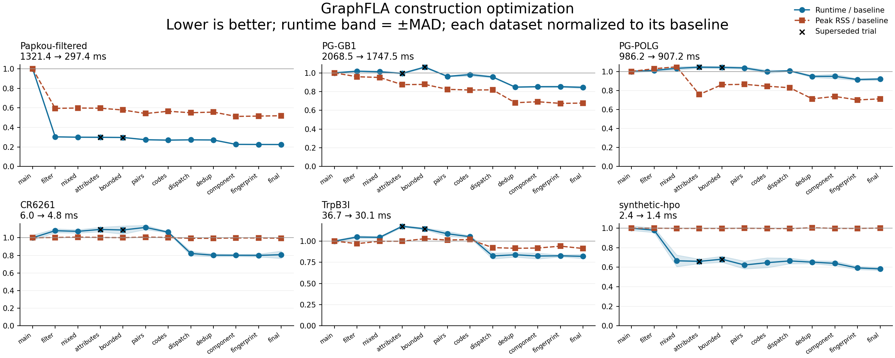

# Construction optimization results

The subsequent [compact construction experiment](ARCHITECTURE_EXPERIMENT.md)
compares a structural change against the final implementation measured here.

Local measurements on an Apple M4 Pro (24 GiB), macOS 26.3, Python 3.13.11. The branch starts at `main` commit `9f86def`; the final measured construction source is `01be0bf`.

The final comparison uses the repeated main control, with three independent timing processes and nine measured builds per dataset. Memory uses three separate fresh processes. Input hashes, graph dimensions and variable-site counts match throughout.

[All 21 dataset curves](results/optimization-all.png) · [Vector version](results/optimization-all.svg) · [Experiment ledger](results/experiments.json) · [Raw final measurements](results/final-verified.json)

The curves start at the first main run and include superseded experiments. The table uses the repeated main control; all baseline-repeat timing changes were inside the noise gate.

## Final comparison

`Clear` means the runtime effect exceeds both 5% and three times the combined measured dispersion. `Unresolved` means a measured difference is not strong enough for a speed claim. Peak RSS includes the interpreter, imports and prepared input; it is not exclusive graph memory.

| Dataset | Main (ms) | Final (ms) | Speed ratio | Peak RSS ratio | Runtime evidence |
|---|---:|---:|---:|---:|---|
| WReOs | 1.49 | 1.55 | 0.96× | 1.00× | Unresolved |
| CR6261 | 6.11 | 4.85 | 1.26× | 0.99× | Unresolved |
| TrpB3I | 36.97 | 29.69 | 1.25× | 0.90× | Clear |
| Westmann | 24.84 | 19.74 | 1.26× | 1.03× | Clear |
| CR9114 | 117.25 | 115.45 | 1.02× | 1.06× | Unresolved |
| GB1 | 926.19 | 855.72 | 1.08× | 0.90× | Clear |
| Papkou | 595.18 | 559.78 | 1.06× | 0.98× | Unresolved |
| Papkou-filtered | 1309.80 | 297.42 | 4.40× | 0.51× | Clear |
| PG-GB1 | 2059.19 | 1747.47 | 1.18× | 0.70× | Clear |
| PG-BRCA2 | 232.91 | 211.96 | 1.10× | 0.96× | Clear |
| PG-POLG | 969.32 | 907.21 | 1.07× | 0.69× | Unresolved |
| RG-BRCA1 | 510.28 | 476.03 | 1.07× | 0.96× | Clear |
| RG-tRNA | 15.65 | 13.69 | 1.14× | 0.97× | Clear |
| RG-ribozyme | 15.04 | 13.52 | 1.11× | 1.00× | Clear |
| RG-LINE1 | 486.69 | 471.48 | 1.03× | 0.80× | Unresolved |
| synthetic-boolean | 9.01 | 7.28 | 1.24× | 0.99× | Clear |
| synthetic-ordinal | 1.16 | 1.17 | 0.99× | 0.99× | Unresolved |
| synthetic-dna | 8.29 | 7.02 | 1.18× | 0.99× | Clear |
| synthetic-rna | 1.80 | 1.44 | 1.26× | 0.99× | Unresolved |
| synthetic-sequence | 1.92 | 1.62 | 1.19× | 0.99× | Unresolved |
| synthetic-hpo | 2.42 | 1.41 | 1.71× | 1.00× | Clear |

No dataset showed a runtime regression beyond the comparison gate. These are measurements on this machine, not portable speed guarantees.

## Correctness and compatibility

- **1,586 tests pass without skips** on Python 3.9.6, 3.11.16 and 3.13.11. This includes pandas 2.3/3.0 and igraph 0.11/1.0 environments.
- The Papkou construction starts from all **261,333 author-archived variants**, reproduces **135,178 nodes and 324,044 directed edges**, and matches every node and directed edge in the authors’ published edge list. Fitness and edge differences are also checked against the unrounded input.
- All seven ProteinGym/RNAGym assays retain their full input backgrounds; the constructed variable-site counts match independent counts from the raw sequences. Small exact tests compare full and manually trimmed backgrounds across sequence classes and input formats.
- ASV discovery and **505 parameterized cases across 37 benchmark methods** pass. All 32 public analysis functions have workloads; analysis implementations were not changed.
- Combined line/branch coverage rises from 59.1% to 69.2% overall. Construction-core line coverage rises from 62.9% to 80.4% (core combined coverage: 75.8%). Coverage does not establish scientific correctness of every analysis.

[Verification environments](results/verification.json) · [Coverage totals](results/coverage.json) · [Measured dependency versions](results/environment-py313.txt)

## Decisions and stopping

Retained changes move functional filtering before graph allocation, share discrete-neighbor lookup, classify each substitution pair once, bound decoded attribute buffers, avoid repeated categorical wrappers and invariant-column hashing, and select supported backends using the encoded geometry. Required input fixes cover overflow, Boolean aliases, indices, field-name collisions, full-neutral graphs and custom neighbor rules.

Unconditional attribute streaming was superseded after small-workload regressions; a bounded path and preservation of native edge containers resolved that tradeoff. Later fingerprint simplification was retained for readability and allocation behavior, with no new runtime speed claim. Smaller lookup batches and narrower indices were rejected after targeted measurements.

Stopped after the three consecutive tuning experiments 10–12 produced no reliable practical gain. The 12 experiments and both rejected focused trials remain recorded; this is a practical stopping rule, not proof of an absolute ceiling.

## Reproduce

See [benchmark setup and protocol](README.md), [test contracts](../tests/README.md), and [Papkou fixture provenance](../tests/fixtures/papkou2023/README.md). Run `python tools/benchmark_round.py --label candidate --output candidate.json`, then compare compatible files with `tools/compare_benchmark_rounds.py`.
